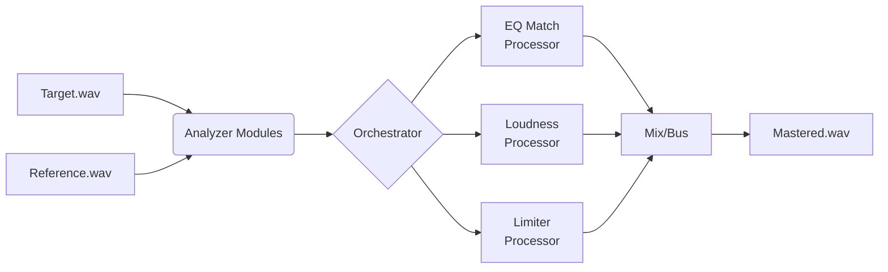

# Audo_EQ: The Open-Source, Reference-Based Mastering Engine for AI-Generated Music

[](https://opensource.org/licenses/MIT)
[](https://www.python.org/downloads/)
[](https://python-poetry.org/)
[](https://github.com/psf/black)

**Audo_EQ** is a professional-grade, modular Python engine for automatic audio mastering. It empowers musicians, producers, and developers to programmatically master audio by matching the sonic characteristics of a professional reference track—**without relying on black-box AI or cloud services**.

Built for the age of AI-generated music, Audo_EQ solves a critical problem: **transforming raw, often uneven AI audio output into polished, release-ready tracks** by applying the proven signal processing techniques of professional mastering engineers.

## 🎯 Project Philosophy

AI music tools excel at ideation but often fall short on final polish. Manual mastering requires expensive tools and expertise. Audo_EQ bridges this gap with a **developer-first, transparent, and locally-runnable** solution. Unlike services that upload your audio or use opaque neural networks, Audo_EQ gives you full control over a pipeline of deterministic, studio-grade audio processors.

## ✨ Core Features

* **🔬 Reference-Based Mastering**: Analyzes a target and reference WAV file to match **Loudness (LUFS), Spectral Balance (EQ), and Dynamics**.
* **🧩 Modular "Studio Rack" Architecture**: Each processing component (EQ Match, Limiter, Dither) is a standalone, composable Python module.
* **⚙️ Pure Signal Processing**: No machine learning black boxes. Uses established DSP algorithms (FFT, Wavelet analysis, digital filters) for predictable, explainable results.
* **💻 Multiple Interfaces**: Use as a Python library, a CLI tool, a Docker container, or integrate its modules into your own web backend.
* **🔒 Privacy-First**: All processing is local. Your audio never leaves your machine.
* **🧪 Built for Experimentation**: Designed for the AI music community to test, tweak, and share mastering "chains" and presets.

## 🏗️ Architecture Overview

Audo_EQ is built like a virtual rack of studio gear. The pipeline is orchestrated but not monolithic:



### Core Modules

| Module | Purpose | Key Technology |
| :--- | :--- | :--- |
| **`analyzer.loudness`** | Calculate LUFS & RMS | `pyloudnorm` (ITU-R BS.1770) |
| **`analyzer.spectrum`** | Extract reference EQ curve | FFT via `scipy` |
| **`analyzer.bpm`** | Detect tempo for segment analysis | Wavelet transform via `scipy` |
| **`processor.eq_match`** | Apply spectral matching | Multiband filtering via `pedalboard` |
| **`processor.loudness_comp`** | Match integrated loudness | Compression & gain staging |
| **`processor.limiter`** | Apply true-peak limiting | Oversampled limiting via `pedalboard` |
| **`processor.dither`** | Noise-shaped bit-depth reduction | Custom TPDF/RPDF dithering |

## 📦 Getting Started

### Prerequisites

* Python 3.11
* [Poetry](https://python-poetry.org/docs/#installation) (dependency management)
* A system capable of running native audio libraries (e.g., `libsndfile`)

### Installation

```bash
# Clone the repository
git clone https://github.com/skyler-saville/audo_eq.git
cd audo_eq

# Install dependencies with Poetry
poetry install

# Activate the virtual environment
poetry shell
```

### Quick Start: Mastering a Track

Place your raw AI-generated track (`target.wav`) and a professional song you admire (`reference.wav`) in a directory, then run:

```bash
# Using the CLI
audo_eq master \
  --target ./my_tracks/ai_demo.wav \
  --reference ./reference_tracks/pro_mix.wav \
  --output ./mastered/mastered_version.wav

# Or using the Makefile shortcut
make process TARGET=./my_tracks/ai_demo.wav REF=./reference_tracks/pro_mix.wav
```

The engine will analyze the reference, create a matching profile, and apply it to your target, outputting a mastered WAV file.

## 🧰 For Developers: Deep Dive

### Project Structure

```bash
audo_eq/
├── src/audo_eq/                 # Main Python package
│   ├── analyzer/               # Analysis modules (LUFS, spectrum, BPM)
│   ├── processor/              # Processing modules (EQ, limit, dither)
│   ├── io/                     # Audio file I/O utilities
│   ├── core.py                 # Pipeline orchestration
│   └── cli.py                  # Command-line interface
├── configs/                    # YAML presets for different genres
├── tests/                      # Pytest unit & integration tests
├── docker/                     # Containerization setup
└── examples/                   # Jupyter notebooks & script examples
```

### Using Audo_EQ as a Python Library

Integrate mastering directly into your AI music generation pipeline:

```python
from audo_eq import MasteringPipeline, create_chain_from_reference
import soundfile as sf

# Load your AI-generated audio and a reference
target_audio, sr = sf.read('ai_generated.wav')
ref_audio, sr = sf.read('professional_reference.wav')

# Create a processing chain based on the reference
chain = create_chain_from_reference(target_audio, ref_audio, sr)

# Initialize the pipeline and process
pipeline = MasteringPipeline(chain)
mastered_audio = pipeline.run(target_audio, sr)

# Save the result
sf.write('mastered_output.wav', mastered_audio, sr)
```

### Creating a Custom Processing Chain

Build your own mastering signature by assembling modules:

```python
from audo_eq.processor import (
    EQMatchProcessor,
    LoudnessCompProcessor,
    LimiterProcessor,
    StereoImagerProcessor
)
from audo_eq import MasteringPipeline

# Define a custom chain for "vintage tape" sound
my_custom_chain = [
    EQMatchProcessor(aggression=0.7),
    LoudnessCompProcessor(target_lufs=-10, crest_factor=6),
    StereoImagerProcessor(width=1.1),
    LimiterProcessor(true_peak=True, threshold_db=-0.5)
]

pipeline = MasteringPipeline(my_custom_chain)
mastered = pipeline.run(raw_audio, sample_rate)
```

## 🐳 Deployment & Scaling

### Dockerized Processing

```bash
# Build the image
docker build -f docker/Dockerfile -t audo-eq .

# Run a mastering job
docker run -v $(pwd)/audio:/audio audo-eq \
  master -t /audio/target.wav -r /audio/ref.wav -o /audio/output.wav
```

### As a Web Backend (FastAPI Example)

Audo_EQ's modular design makes it ideal for microservices. See the `examples/web_backend/` directory for a complete FastAPI implementation that can be deployed on Railway, Fly.io, or your own infrastructure.

## 🧪 Testing & Contribution

Run the test suite to ensure everything works:

```bash
# Run all tests
make test

# Run with coverage report
poetry run pytest --cov=src/audo_eq tests/

# Lint code
make lint
```

### How to Contribute

We welcome contributions from audio developers, DSP engineers, and AI musicians:

1. **Fork** the repository
2. **Create a feature branch** (`git checkout -b feature/new-eq-algorithm`)
3. **Add tests** for your changes
4. **Commit** (`git commit -am 'Add wavelet-based transient detection'`)
5. **Push** (`git push origin feature/new-eq-algorithm`)
6. **Open a Pull Request**

Priority areas for contribution:

* New analysis modules (transient detection, harmonic balance)
* Alternative processing algorithms (linear-phase EQ, multiband compression)
* Presets for specific AI music platforms (Suno, Udio, Stable Audio)
* FastAPI backend
* Web frontend interfaces

## 📚 Advanced Usage & Presets

### Genre-Specific Configurations

Pre-tuned configurations are available in `configs/`:

```bash
# Master for streaming platforms (-14 LUFS, true-peak safe)
audo_eq master -t target.wav -r ref.wav -c configs/streaming_ready.yaml

# Aggressive "modern metal" profile
audo_eq master -t target.wav -r ref.wav -c configs/modern_metal.yaml

# Vintage "lo-fi beats" profile
audo_eq master -t target.wav -r ref.wav -c configs/lofi_beats.yaml
```

### Integration with AI Music Pipelines

Example integration with Suno.ai output:

```python
# example_suno_integration.py
import audo_eq
from suno_api import generate_song
from youtube_dl import download_reference

# 1. Generate AI track
ai_audio = generate_song(prompt="psychedelic rock song with fuzzy guitar")

# 2. Download professional reference
ref_audio = download_reference("https://youtube.com/watch?v=...")

# 3. Master using Audo_EQ
mastered = audo_eq.master(ai_audio, ref_audio)

# 4. Upload to distribution
distrokit.upload(mastered, metadata={"title": "AI Psychedelic Rock"})
```

## 🚀 Roadmap & Vision

* **v0.3.0**: Real-time streaming support for live AI music generation
* **v0.5.0**: VST3/AU plugin wrapper for DAW integration
* **v1.0.0**: Community marketplace for sharing processor modules and presets
* **Future**: Collaborative cloud mastering with version control for audio chains

## 🙏 Acknowledgments & Inspiration

Audo_EQ stands on the shoulders of giants:

* **Benjamin Rosseaux's [Masterknecht](https://masterknecht.klangknecht.com/)** for pioneering browser-based reference mastering
* **Spotify's [Pedalboard](https://github.com/spotify/pedalboard)** for high-performance audio processing
* The **True Rock Alliance** and broader AI music community for pioneering new creative workflows
* **Digital Signal Processing** research that makes transparent audio engineering possible

## 📄 License

Audo_EQ is released under the **MIT License**. See the `LICENSE` file for details.

This means you can use it commercially, privately, modify it, and distribute it, with minimal restrictions.
