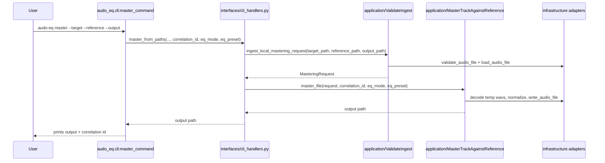
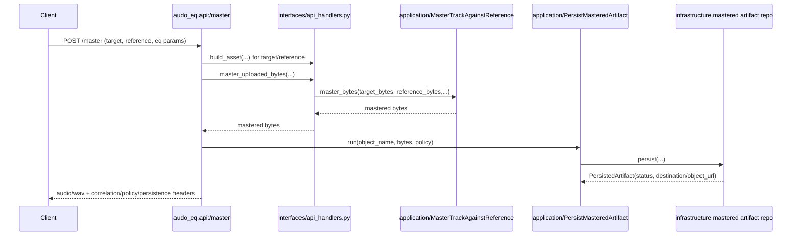

# Architecture Overview

This document describes the **current implementation** architecture of `audo-eq` using the layered package layout under `src/audo_eq/*`, and calls out extension points that align with the longer-term DDD roadmap in [`docs/roadmap-ddd.md`](./roadmap-ddd.md).

> Roadmap note: use this page for "what exists now" and use [`docs/roadmap-ddd.md`](./roadmap-ddd.md) for "what we are evolving toward" (bounded contexts, richer event contracts, stricter anti-corruption boundaries).

## Layered/module map (current implementation)

```text
src/audo_eq/
├── interfaces/                # Delivery adapters (CLI/API handler glue)
│   ├── cli_handlers.py
│   └── api_handlers.py
├── application/               # Use-case orchestration + ports
│   ├── mastering_service.py
│   ├── artifact_persistence_service.py
│   ├── mastered_artifact_repository.py
│   └── event_publisher.py
├── domain/                    # Core domain contracts/rules
│   ├── models.py
│   ├── services.py
│   ├── policies.py
│   └── events.py
└── infrastructure/            # Concrete adapters for ports/codecs/storage/temp files
    ├── logging_event_publisher.py
    ├── mastered_artifact_repositories.py
    ├── pedalboard_codec.py
    ├── minio_storage.py
    └── temp_files.py
```

### Dependency direction (intended)

- `interfaces` -> `application`
- `application` -> `domain` + lower-level processing/analysis modules + application ports
- `infrastructure` implements application ports and is wired at edges (`interfaces` and API module)
- `domain` remains free of framework/storage concerns

## Request sequence flows into mastering service

### 1) CLI flow (`audo_eq.cli` -> `interfaces` -> `application`)



### 2) API flow (`audo_eq.api` -> `interfaces` -> `application`)



## Responsibility table (key classes/functions)

| Layer | Module/class/function | Responsibility now | Does **not** own |
| --- | --- | --- | --- |
| Interface | `src/audo_eq/cli.py::master_command` | Parse CLI options, create correlation id, invoke handler, print result. | DSP logic, policy math, persistence policy decisions. |
| Interface | `src/audo_eq/api.py::master` | Parse HTTP query/header/upload inputs, map validation errors to HTTP status, set response headers, trigger persistence workflow. | Core mastering signal chain implementation. |
| Interface | `src/audo_eq/interfaces/cli_handlers.py::master_from_paths` | Thin adapter wiring CLI to `ValidateIngest` + `MasterTrackAgainstReference`. | Low-level decoding/processing implementation details. |
| Interface | `src/audo_eq/interfaces/api_handlers.py::{build_asset, master_uploaded_bytes}` | Thin adapter for byte validation/materialization and delegation to mastering service. | HTTP concerns (kept in `api.py`) and storage persistence decisions. |
| Application | `src/audo_eq/application/mastering_service.py::ValidateIngest` | Build validated `AudioAsset`/`MasteringRequest`, publish ingest events. | Transport-specific parsing, object-store persistence. |
| Application | `src/audo_eq/application/mastering_service.py::MasterTrackAgainstReference` | Orchestrate analyze -> decide -> process pipeline; run bytes/file workflows; publish mastering lifecycle events. | Framework endpoints and concrete storage SDK calls. |
| Application | `src/audo_eq/application/artifact_persistence_service.py::PersistMasteredArtifact` | Enforce persistence policy semantics (`mode` + `guarantee`) around repository port results. | Actual queue/object-store SDK integration. |
| Application (port) | `src/audo_eq/application/mastered_artifact_repository.py::MasteredArtifactRepository` | Contract for persistence adapters to implement. | Concrete persistence mechanism. |
| Application (port) | `src/audo_eq/application/event_publisher.py::EventPublisher` | Contract for domain event publication. | Logging/message-broker specifics. |
| Domain | `src/audo_eq/domain/services.py::compute_loudness_gain_delta_db` | Pure business rule for bounded loudness delta. | I/O, logging, request parsing. |
| Domain | `src/audo_eq/domain/events.py` | Event contracts (`IngestValidated`, `TrackAnalyzed`, etc.) shared across layers. | Event transport implementation. |
| Infrastructure | `src/audo_eq/infrastructure/logging_event_publisher.py::LoggingEventPublisher` | Concrete event publisher via structured logs. | Event contract definitions or orchestration decisions. |
| Infrastructure | `src/audo_eq/infrastructure/mastered_artifact_repositories.py` | Concrete persistence adapters (immediate object storage vs deferred queue placeholder). | Persistence policy enforcement logic (kept in application service). |

## Extension points

### New storage backends

Use the `MasteredArtifactRepository` port:

1. Implement `persist(object_name, audio_bytes, content_type)` in a new adapter under `src/audo_eq/infrastructure/`.
2. Return `PersistedArtifact` statuses that match policy semantics (`stored`, `deferred`, etc.).
3. Wire adapter selection in `audo_eq.api._build_repository_for_mode` (or equivalent composition root).

### Alternate event publishers

Use the `EventPublisher` port:

1. Implement `publish(event: DomainEvent)` (e.g., Kafka/SNS/NATS publisher).
2. Instantiate it where handlers currently use `LoggingEventPublisher` (`interfaces/cli_handlers.py`, `interfaces/api_handlers.py`).
3. Keep event contract classes in `domain/events.py` unchanged so publishers remain replaceable.

### Additional interfaces

To add another delivery interface (e.g., batch worker, gRPC, queue consumer):

1. Add new module(s) under `src/audo_eq/interfaces/`.
2. Reuse application services (`ValidateIngest`, `MasterTrackAgainstReference`, `PersistMasteredArtifact`).
3. Keep parsing/protocol mapping in the interface layer; keep mastering orchestration in `application`.

## Current vs future direction

- **Current implementation (this doc):** pragmatic layered architecture with clear package boundaries and application ports for events/persistence.
- **Future direction (roadmap):** bounded contexts (Ingest/Analysis/Decisioning/Processing/Delivery/Artifact Storage), stronger anti-corruption boundaries, and versioned domain-event contract rollout.

See [`docs/roadmap-ddd.md`](./roadmap-ddd.md) for milestones and acceptance criteria that evolve this architecture beyond the current implementation.
